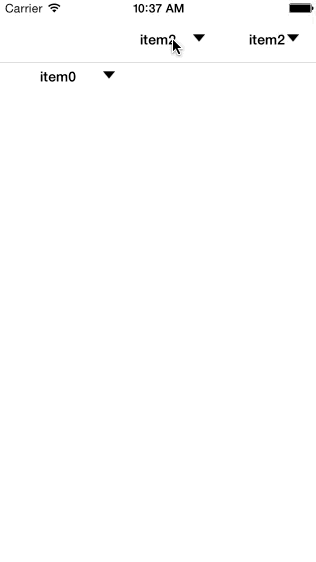

iOS中的下拉菜单
===

## 使用方法

初始化方法

1.  `- (id)initWithFrame:(CGRect)frame items:(NSArray *)items delegate:(id)delegate displayView:(UIView *)displayView isNavigationView:(BOOL)flag;`
`frame`： 定义下拉菜单头的位置
`items`： 定义下拉菜单的数据源，是`WGItem`的`NSArray`
`displayView`： 显示下拉菜单的view
`isNavigationView`：下拉菜单的头是否在导航栏
2. 将初始化的`WGDropDownView`你想要放入的view即可

### 其他说明

1. 你可以通过修改`WGItem`很方便定义你想要穿到每个cell的对象
2. 你可以通过修改`WGItemCell`修改你的cell样式，通过修改`- (void)configureItem:(WGItem *)item;`方法建立它与`WGItem`对象的对应关系。

